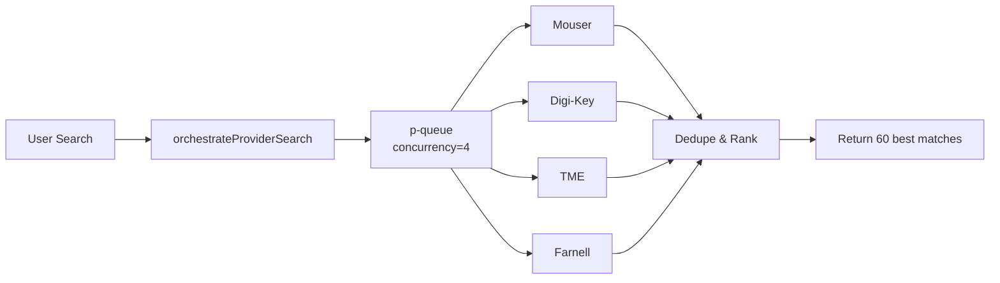

# Provider Integration Documentation

**Version**: 3.2  
**Last Updated**: 2025-10-08  
**Status**: Production

---

## Table of Contents

1. [Overview](#overview)
2. [Architecture](#architecture)
3. [Provider Catalog](#provider-catalog)
4. [Data Contract](#data-contract)
5. [Orchestration](#orchestration)
6. [Regional Endpoints](#regional-endpoints)
7. [Security & Privacy](#security--privacy)
8. [Troubleshooting](#troubleshooting)

---

## Overview

Deep Components Aggregator integrates with **4 major electronic component distributors**:

| Provider | Region | Coverage | Authentication |
|----------|--------|----------|----------------|
| **Mouser** | Global | 5M+ SKUs | API Key |
| **Digi-Key** | Global | 15M+ SKUs | OAuth 2.0 |
| **TME** | Europe/Russia | 500K+ SKUs | Token + HMAC |
| **Farnell** | Global | 2M+ SKUs | API Key |

### Key Principles

1. **Catalog vs Pricing Separation**: Product metadata (MPN, manufacturer, specs) is separate from pricing/availability data
2. **No Dealer Links in UI**: All provider-specific URLs are **hidden from end users** (admin-only)
3. **Regional Routing**: Pricing/stock fetched from region-specific endpoints
4. **Timeout-First**: All API calls have 9.5s hard timeout via `AbortSignal`
5. **Concurrency Control**: Max 4 providers run in parallel (p-queue)

---

## Architecture

### 1. Orchestration Layer

**File**: `src/search/providerOrchestrator.mjs`



**Concurrency**: 4 providers run in parallel  
**Timeout**: 9.5s per provider (configurable via `PROVIDER_TIMEOUT`)  
**Metrics**: Prometheus counters for success/error/duration

### 2. Provider Clients

Each provider has 3 files:

```
src/integrations/{provider}/
├── client.mjs      # HTTP client with auth
├── normalize.mjs   # Data transformation to common schema
└── README.md       # Provider-specific docs
```

### 3. Search Enhancement

**File**: `src/search/searchIntegration.mjs`

- **Russian → English translation**: `резистор 1кОм` → `resistor 1kΩ`
- **MPN detection**: Detects part numbers (e.g., `LM358`) and prioritizes exact match
- **Retry logic**: Up to 3 attempts with fallback queries
- **Caching**: SQLite cache (7-day TTL)

---

## Provider Catalog

### Mouser Electronics

**Base URL**: `https://api.mouser.com/api/v1/`  
**Auth**: API Key (header)  
**Rate Limits**: 1000 req/day (free tier)

#### Endpoints

| Endpoint | Method | Purpose |
|----------|--------|---------|
| `/search/keyword` | POST | Search by keyword/MPN |
| `/search/manufacturerlist` | GET | Get part by exact MPN |

#### Data Coverage

- ✅ Product catalog (MPN, manufacturer, description)
- ✅ Pricing (volume breaks, currency: USD)
- ✅ Stock availability
- ✅ Images & datasheets
- ✅ Parameters (resistance, voltage, etc.)

#### Pricing Policy

- **Currency**: USD only
- **Conversion**: Converted to RUB via CBR daily rates
- **Volume Breaks**: Returned as array (qty → price)

---

### Digi-Key

**Base URL**: `https://api.digikey.com/v1/`  
**Auth**: OAuth 2.0 Client Credentials  
**Rate Limits**: 1000 req/day (sandbox)

#### Endpoints

| Endpoint | Method | Purpose |
|----------|--------|---------|
| `/oauth2/token` | POST | Get access token |
| `/Search/v4/Products/Keyword` | POST | Search by keyword |
| `/Search/v4/Products/{dkpn}` | GET | Get product by DigiKey PN |

#### Data Coverage

- ✅ Product catalog (15M+ SKUs)
- ✅ Pricing (USD, EUR, GBP)
- ✅ Stock (global warehouses)
- ✅ Rich parametric data
- ⚠️  OAuth token expires every 1800s (auto-refresh)

#### OAuth Flow

```javascript
// Token cached in-memory (30min lifetime)
const token = await getDigiKeyToken(clientId, clientSecret);

// All requests use Bearer token
fetch(url, { headers: { 'Authorization': `Bearer ${token}` } });
```

---

### TME (Transfer Multisort Elektronik)

**Base URL**: `https://api.tme.eu/`  
**Auth**: HMAC-SHA1 signature  
**Rate Limits**: None (generous)

#### Endpoints

| Endpoint | Method | Purpose |
|----------|--------|---------|
| `/Products/Search.json` | POST | Search products |
| `/Products/GetProducts.json` | POST | Get details (pricing!) |
| `/Products/GetPrices.json` | POST | Get pricing for multiple SKUs |

#### CRITICAL: Two-Step Flow

1. **Search** → Returns basic info (Symbol, Description) **WITHOUT pricing**
2. **GetProducts** → Call with Symbol array to get PriceList/InStock

```javascript
// Step 1: Search
const searchResults = await tmeSearchProducts({ query: 'LM358' });
const symbols = searchResults.map(p => p.Symbol); // ["LM358N", "LM358DT"]

// Step 2: Get pricing
const details = await tmeGetProduct({ symbols }); // Pass ALL symbols!
```

#### HMAC Signature

```javascript
// Signature = HMAC-SHA1(base, secret)
// Base = METHOD&URL&sorted(PARAMS)
const base = 'POST&https%3A%2F%2Fapi.tme.eu%2FProducts%2FSearch.json&Country%3DPL%26Token%3D{token}';
const signature = crypto.createHmac('sha1', secret).update(base).digest('base64');
```

#### Regional Endpoints

- **Poland (PL)**: Default, best availability
- **Russia (RU)**: Use `Country=RU` parameter (sanctions may apply)
- **EU**: Use `Country=DE|FR|UK`

---

### Farnell

**Base URL**: `https://api.element14.com/catalog/products`  
**Auth**: API Key (query param)  
**Rate Limits**: Unknown

#### Regional Domains

| Region | Domain | Currency |
|--------|--------|----------|
| **UK** | `uk.farnell.com` | GBP |
| **US** | `www.newark.com` | USD |
| **APAC** | `sg.element14.com` | SGD |

#### Endpoints

| Endpoint | Method | Purpose |
|----------|--------|---------|
| `/keywordSearch` | GET | Search by keyword |
| `/mpnSearch` | GET | Search by exact MPN |

#### Data Coverage

- ✅ Catalog (2M+ products)
- ✅ Pricing (multi-currency)
- ✅ Stock (regional warehouses)
- ⚠️  API returns nested XML-style JSON (complex parsing)

---

## Data Contract

### Common Schema

All providers normalize to this schema:

```javascript
{
  source: 'mouser|digikey|tme|farnell',
  mpn: 'LM358N',                        // Manufacturer Part Number
  manufacturer: 'Texas Instruments',
  title: 'LM358N - Dual Op-Amp',        // Short title
  description_short: 'Dual operational amplifier...',
  description_long: 'Full datasheet text...',     // Optional
  
  stock: 5000,                           // In-stock quantity
  min_order_qty: 1,
  packaging: 'Tube',
  
  price_breaks: [
    { qty: 1, price_usd: 0.50, price_rub: 41.0 },
    { qty: 10, price_usd: 0.45, price_rub: 36.9 },
    { qty: 100, price_usd: 0.40, price_rub: 32.8 }
  ],
  min_price_usd: 0.50,
  min_price_rub: 41.0,
  
  image_url: 'https://cdn.mouser.com/images/...',
  datasheet_url: 'https://www.ti.com/lit/ds/...',
  
  // HIDDEN from UI (admin-only)
  provider_url: 'https://www.mouser.com/ProductDetail/...',
  provider_sku: 'MOUSER-123456'
}
```

### Catalog vs Pricing Separation

| Field | Catalog | Pricing | Notes |
|-------|---------|---------|-------|
| `mpn` | ✅ | - | Immutable |
| `manufacturer` | ✅ | - | Immutable |
| `description_short` | ✅ | - | Rarely changes |
| `stock` | - | ✅ | Updates hourly |
| `price_breaks` | - | ✅ | Updates daily |
| `image_url` | ✅ | - | Cached forever |
| `datasheet_url` | ✅ | - | Cached forever |

**Caching Strategy**:
- **Catalog**: 30 days (SQLite)
- **Pricing**: 1 day (SQLite)
- **Search results**: 7 days (SQLite)

---

## Orchestration

### Concurrency Model

```javascript
import PQueue from 'p-queue';

const queue = new PQueue({ concurrency: 4 });

// All providers run in parallel (max 4 at once)
const tasks = [
  queue.add(() => withTimeout('mouser', () => runMouser(...))),
  queue.add(() => withTimeout('digikey', () => runDigiKey(...))),
  queue.add(() => withTimeout('tme', () => runTME(...))),
  queue.add(() => withTimeout('farnell', () => runFarnell(...)))
];

const results = await Promise.all(tasks);
```

### Timeout & Abort

```javascript
const withTimeout = async (providerName, fn, timeoutMs = 9500) => {
  const controller = new AbortController();
  const timeoutId = setTimeout(() => controller.abort(), timeoutMs);
  
  try {
    const result = await fn(controller.signal);
    clearTimeout(timeoutId);
    return result;
  } catch (error) {
    clearTimeout(timeoutId);
    if (error.name === 'AbortError') {
      throw new Error(`Provider timeout after ${timeoutMs}ms`);
    }
    throw error;
  }
};
```

### Deduplication

**Key**: `provider::mpn` (lowercase)

```javascript
const key = `${provider}::${mpn.toLowerCase()}`;
// Example: "mouser::lm358n"
```

**Conflict Resolution**:
1. Better price → wins
2. Same price + higher stock → wins
3. Same price + same stock + more metadata → wins

### Ranking Algorithm

```javascript
// Score factors (descending priority):
1. Exact MPN match (query === mpn)
2. Partial match (query in title/manufacturer)
3. Description match (query in description)
4. In-stock availability
5. Lower price
```

---

## Regional Endpoints

### WARP Proxy Routing

All external API calls route through **Cloudflare WARP** proxy (Poland):

```bash
HTTP_PROXY=http://127.0.0.1:18080
HTTPS_PROXY=http://127.0.0.1:18080
```

**Geo-location**: Poland (IP: 104.28.219.137)  
**Purpose**: Bypass Russian IP blocks on Mouser/DigiKey

### Currency Conversion

**Source**: Central Bank of Russia (CBR) daily rates  
**Endpoint**: `https://www.cbr-xml-daily.ru/daily_json.js`  
**Update**: Every 24h (cached in-memory)

```javascript
import { toRUB } from './src/currency/toRUB.mjs';

const priceRub = toRUB(priceUsd, 'USD'); // Uses cached CBR rates
```

---

## Security & Privacy

### 1. No Dealer Links in UI

**Policy**: All `provider_url` fields are **NEVER** rendered in frontend.

**Rationale**: Compliance with Russian import restrictions — users must not see direct purchase links to sanctioned distributors.

**Implementation**:
```javascript
// ❌ FORBIDDEN in frontend
<a href={product.provider_url}>Buy on Mouser</a>

// ✅ ALLOWED in admin panel (Nginx basic auth)
GET /api/admin/products/{id} → includes provider_url
```

### 2. API Key Management

**Storage**: Environment variables only (no hardcoded keys)

```bash
# .env (gitignored)
MOUSER_API_KEY=your-key-here
DIGIKEY_CLIENT_ID=your-id
DIGIKEY_CLIENT_SECRET=your-secret
TME_TOKEN=your-token
TME_SECRET=your-secret
FARNELL_API_KEY=your-key
```

**Rotation**: Every 90 days (manual process)

### 3. Request Logging

**Prometheus Metrics**:
```
api_calls_total{source="mouser",status="success"} 1543
api_calls_total{source="digikey",status="error"} 23
api_call_duration_seconds{source="tme",quantile="0.99"} 2.5
```

**No PII**: Queries are logged, but user IDs are not associated.

---

## Troubleshooting

### Provider Not Returning Results

**Check**:
1. API keys loaded? → `curl http://localhost:9201/api/health | jq .sources`
2. WARP proxy active? → `warp-cli status`
3. Timeout too low? → Increase `PROVIDER_TIMEOUT` in `package.json`
4. Rate limit hit? → Check provider dashboard

### TME Returns Empty Pricing

**Root Cause**: `tmeSearchProducts` doesn't return `PriceList` — must call `tmeGetProduct`

**Fix**: Always call `GetProducts` with Symbol array:
```javascript
const symbols = searchResults.map(p => p.Symbol).slice(0, 10);
await tmeGetProduct({ symbols });
```

### DigiKey 401 Unauthorized

**Root Cause**: OAuth token expired (30min lifetime)

**Fix**: Token auto-refreshes. If persistent, check:
```bash
# Test OAuth manually
curl -X POST https://api.digikey.com/v1/oauth2/token \
  -d "client_id=$DIGIKEY_CLIENT_ID" \
  -d "client_secret=$DIGIKEY_CLIENT_SECRET" \
  -d "grant_type=client_credentials"
```

### Mouser Timeout

**Root Cause**: Mouser API is slow (avg 3-5s)

**Fix**: Acceptable — orchestrator runs in parallel. If timeout, increase `PROVIDER_TIMEOUT`.

---

## References

- [Mouser API Docs](https://www.mouser.com/api-hub/)
- [Digi-Key API Portal](https://developer.digikey.com/)
- [TME API Docs](https://developers.tme.eu/)
- [Farnell API Docs](https://partner.element14.com/docs/Product_Search_API_REST__Description)
- [Cloudflare WARP Docs](https://developers.cloudflare.com/warp-client/)

---

**Maintained by**: Deep Components Aggregator Team  
**Last Review**: 2025-10-08  
**Next Review**: 2026-01-08 (quarterly)
