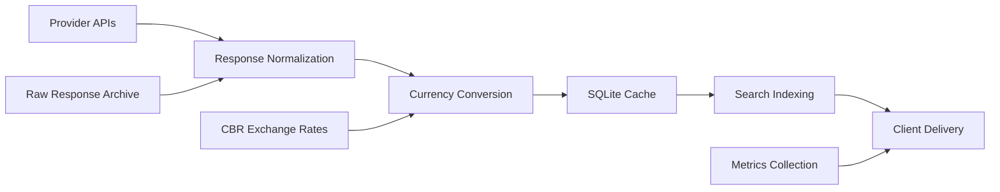

# Data Flow Architecture

The platform follows a clear data pipeline from provider APIs through normalization, caching, and delivery to the frontend.

## Data Pipeline Overview



## Data Sources

### Primary Provider APIs

#### Digi-Key API v3
- **Authentication**: OAuth 2.0 with refresh tokens
- **Rate Limits**: 1000 requests/day (sandbox), 10000/day (production)
- **Data Format**: JSON with nested objects
- **Proxy**: Required (WARP) for Russian IP access

#### Mouser API v1
- **Authentication**: API Key in query parameters
- **Rate Limits**: 10000 requests/month
- **Data Format**: JSON with arrays
- **Proxy**: Not required

#### Farnell/Element14 API
- **Authentication**: API Key in headers
- **Rate Limits**: 5000 requests/month
- **Data Format**: JSON with metadata wrappers
- **Proxy**: Not required

#### TME API v1
- **Authentication**: Token + Secret signature
- **Rate Limits**: Variable by account type
- **Data Format**: JSON with nested product details
- **Proxy**: Not required

### Secondary Data Sources

#### Central Bank of Russia (CBR)
- **URL**: `https://www.cbr.ru/scripts/XML_daily.asp`
- **Format**: XML with currency rates
- **Update Schedule**: Daily at 12:00 MSK
- **Caching**: 12-hour TTL in local storage

## Data Normalization

### Canonical Product Schema

All provider responses are normalized to a standard schema:

```json
{
  "mpn": "STM32F407VGT6",
  "manufacturer": "STMicroelectronics",
  "description": "ARM Cortex-M4 32b MCU+FPU",
  "datasheet": "https://www.st.com/resource/en/datasheet/stm32f407vg.pdf",
  "pricing": [
    {
      "quantity": 1,
      "price_original": 12.45,
      "currency_original": "USD",
      "price_rub": 1033.35,
      "currency_rub": "RUB"
    }
  ],
  "stock": 1500,
  "provider": "digikey",
  "providerSku": "497-11767-ND",
  "category": "Microcontrollers",
  "package": "LQFP-100",
  "updated": "2025-10-07T14:30:00.000Z"
}
```

### Provider-Specific Mapping

#### Digi-Key Normalization
```javascript
function normalizeDigi keyProduct(product) {
  return {
    mpn: product.ManufacturerPartNumber,
    manufacturer: product.Manufacturer?.Name,
    description: product.ProductDescription,
    datasheet: product.PrimaryDatasheet,
    pricing: product.StandardPricing?.map(tier => ({
      quantity: tier.BreakQuantity,
      price_original: tier.UnitPrice,
      currency_original: tier.Currency
    })) || [],
    stock: product.QuantityAvailable,
    provider: 'digikey',
    providerSku: product.DigiKeyPartNumber,
    category: product.Category?.Name,
    package: product.PackageType?.Name,
    updated: new Date().toISOString()
  };
}
```

#### Mouser Normalization
```javascript
function normalizeMouserProduct(product) {
  return {
    mpn: product.ManufacturerPartNumber,
    manufacturer: product.Manufacturer,
    description: product.Description,
    datasheet: product.DataSheetUrl,
    pricing: product.PriceBreaks?.map(tier => ({
      quantity: tier.Quantity,
      price_original: parseFloat(tier.Price.replace(/[$,]/g, '')),
      currency_original: tier.Currency
    })) || [],
    stock: product.AvailabilityInStock,
    provider: 'mouser',
    providerSku: product.MouserPartNumber,
    category: product.Category,
    package: product.PackageType,
    updated: new Date().toISOString()
  };
}
```

## Currency Conversion Pipeline

### Exchange Rate Management

```javascript
class CurrencyConverter {
  constructor() {
    this.rates = new Map();
    this.lastUpdate = null;
    this.CACHE_TTL = 12 * 60 * 60 * 1000; // 12 hours
  }
  
  async getRates() {
    if (this.needsUpdate()) {
      await this.fetchRatesFromCBR();
    }
    return this.rates;
  }
  
  async fetchRatesFromCBR() {
    const response = await fetch('https://www.cbr.ru/scripts/XML_daily.asp');
    const xmlText = await response.text();
    const parser = new DOMParser();
    const doc = parser.parseFromString(xmlText, 'text/xml');
    
    const valuteNodes = doc.querySelectorAll('Valute');
    const newRates = new Map();
    
    valuteNodes.forEach(node => {
      const code = node.querySelector('CharCode').textContent;
      const value = parseFloat(node.querySelector('Value').textContent.replace(',', '.'));
      const nominal = parseInt(node.querySelector('Nominal').textContent);
      
      newRates.set(code, value / nominal);
    });
    
    this.rates = newRates;
    this.lastUpdate = Date.now();
  }
  
  convertToRub(amount, currency) {
    if (currency === 'RUB') return amount;
    
    const rate = this.rates.get(currency);
    if (!rate) throw new Error(`Unknown currency: ${currency}`);
    
    return amount * rate;
  }
}
```

### Price Break Conversion

```javascript
function convertPricingToRub(pricing, rates) {
  return pricing.map(tier => ({
    ...tier,
    price_rub: converter.convertToRub(tier.price_original, tier.currency_original),
    currency_rub: 'RUB'
  }));
}
```

## Data Storage

### SQLite Database Schema

```sql
-- Products table
CREATE TABLE products (
  id INTEGER PRIMARY KEY AUTOINCREMENT,
  mpn TEXT NOT NULL,
  manufacturer TEXT,
  description TEXT,
  datasheet TEXT,
  category TEXT,
  package TEXT,
  provider TEXT NOT NULL,
  provider_sku TEXT,
  stock INTEGER DEFAULT 0,
  min_price_rub REAL,
  updated DATETIME DEFAULT CURRENT_TIMESTAMP,
  UNIQUE(mpn, provider)
);

-- Price breaks table
CREATE TABLE pricing (
  id INTEGER PRIMARY KEY AUTOINCREMENT,
  product_id INTEGER REFERENCES products(id),
  quantity INTEGER NOT NULL,
  price_original REAL NOT NULL,
  currency_original TEXT NOT NULL,
  price_rub REAL NOT NULL,
  currency_rub TEXT DEFAULT 'RUB'
);

-- Search index
CREATE VIRTUAL TABLE products_fts USING fts5(
  mpn, manufacturer, description, category,
  content='products',
  content_rowid='id'
);

-- Indexes for performance
CREATE INDEX idx_products_mpn ON products(mpn);
CREATE INDEX idx_products_manufacturer ON products(manufacturer);
CREATE INDEX idx_products_provider ON products(provider);
CREATE INDEX idx_pricing_product_id ON pricing(product_id);
```

### Data Archival

Raw provider responses are archived for analysis:

```javascript
// Archive raw response
async function archiveRawResponse(provider, query, response) {
  const timestamp = new Date().toISOString().slice(0, 10);
  const filename = `${provider}-${query.replace(/[^a-z0-9]/gi, '_')}-${Date.now()}.json`;
  const filepath = `docs/_artifacts/${timestamp}/providers/raw/${filename}`;
  
  await fs.writeFile(filepath, JSON.stringify({
    provider,
    query,
    timestamp: new Date().toISOString(),
    response,
    metadata: {
      ip: req.ip,
      userAgent: req.get('User-Agent'),
      responseTime: Date.now() - startTime
    }
  }, null, 2));
}
```

## Caching Strategy

### Multi-Level Caching

#### Level 1: In-Memory Cache
```javascript
const searchCache = new Map();
const SEARCH_CACHE_TTL = 5 * 60 * 1000; // 5 minutes

function getCachedSearch(query) {
  const cached = searchCache.get(query.toLowerCase());
  return cached && (Date.now() - cached.timestamp < SEARCH_CACHE_TTL) 
    ? cached.data 
    : null;
}
```

#### Level 2: SQLite Cache
```javascript
async function getCachedProducts(mpns) {
  const placeholders = mpns.map(() => '?').join(',');
  const query = `
    SELECT p.*, pr.quantity, pr.price_rub 
    FROM products p 
    LEFT JOIN pricing pr ON p.id = pr.product_id 
    WHERE p.mpn IN (${placeholders})
    AND p.updated > datetime('now', '-1 hour')
  `;
  
  return await db.all(query, mpns);
}
```

#### Level 3: Provider API
```javascript
async function fetchFromProvider(provider, query) {
  // Only called when cache misses
  const response = await providers[provider].search(query);
  
  // Cache for future requests
  await cacheProducts(response.products);
  
  return response;
}
```

### Cache Invalidation

```javascript
// Time-based invalidation
setInterval(async () => {
  await db.run('DELETE FROM products WHERE updated < datetime("now", "-24 hours")');
  await db.run('DELETE FROM pricing WHERE product_id NOT IN (SELECT id FROM products)');
}, 60 * 60 * 1000); // Every hour

// Event-based invalidation
function invalidateProductCache(mpn) {
  searchCache.clear(); // Clear all search results
  db.run('DELETE FROM products WHERE mpn = ?', [mpn]);
}
```

## Data Quality Management

### Duplicate Detection

```javascript
function deduplicateProducts(products) {
  const seen = new Map();
  const unique = [];
  
  products.forEach(product => {
    const key = `${product.mpn}-${product.manufacturer}`.toLowerCase();
    
    if (!seen.has(key)) {
      seen.set(key, product);
      unique.push(product);
    } else {
      // Merge data from multiple providers
      const existing = seen.get(key);
      mergeProductData(existing, product);
    }
  });
  
  return unique;
}
```

### Data Validation

```javascript
function validateProduct(product) {
  const errors = [];
  
  if (!product.mpn || product.mpn.length < 2) {
    errors.push('Invalid MPN');
  }
  
  if (!product.manufacturer) {
    errors.push('Missing manufacturer');
  }
  
  if (!product.pricing || product.pricing.length === 0) {
    errors.push('No pricing data');
  }
  
  product.pricing?.forEach((tier, i) => {
    if (!tier.quantity || tier.quantity <= 0) {
      errors.push(`Invalid quantity in tier ${i}`);
    }
    if (!tier.price_original || tier.price_original <= 0) {
      errors.push(`Invalid price in tier ${i}`);
    }
  });
  
  return {
    valid: errors.length === 0,
    errors
  };
}
```

## Performance Monitoring

### Data Pipeline Metrics

```javascript
// Track data processing performance
const pipelineMetrics = {
  providerResponse: new Histogram({
    name: 'provider_response_time_seconds',
    help: 'Provider API response time',
    labelNames: ['provider', 'status']
  }),
  
  normalizationTime: new Histogram({
    name: 'data_normalization_seconds',
    help: 'Time spent normalizing provider responses'
  }),
  
  cacheHitRate: new Counter({
    name: 'cache_hits_total',
    help: 'Cache hit/miss statistics',
    labelNames: ['type', 'status']
  })
};
```

### Data Quality Metrics

```javascript
// Track data quality over time
const qualityMetrics = {
  duplicatesDetected: new Counter({
    name: 'duplicates_detected_total',
    help: 'Number of duplicate products detected'
  }),
  
  validationErrors: new Counter({
    name: 'validation_errors_total',
    help: 'Number of validation errors by type',
    labelNames: ['error_type', 'provider']
  }),
  
  priceConversionErrors: new Counter({
    name: 'price_conversion_errors_total',
    help: 'Currency conversion failures'
  })
};
```
