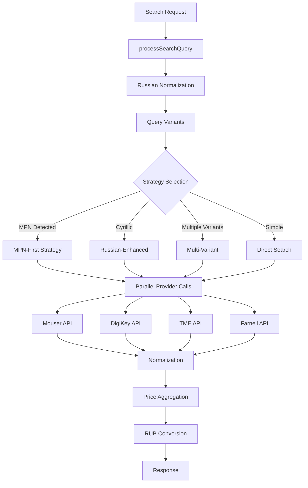

# Provider Orchestrator

The provider orchestrator coordinates parallel searches across multiple electronic component suppliers.

## Architecture



## Search Flow

### 1. Query Processing

**File**: `src/search/searchIntegration.mjs`

```javascript
export function processSearchQuery(originalQuery) {
  // 1. Validate input
  // 2. Apply Russian normalization
  // 3. Generate query variants
  // 4. Extract MPNs
  // 5. Return enhanced search params
}
```

**Outputs**:
- `queries[]`: Array of search variants (original, transliterated, token-based, MPN)
- `mpns[]`: Extracted manufacturer part numbers
- `metadata`: Processing steps and flags (hasCyrillic, transliterated, tokenCount)

### 2. Strategy Selection

**Function**: `selectSearchStrategy(processedQuery)`

Strategies:
1. **mpn-first**: When MPNs detected → use first MPN as primary query
2. **russian-enhanced**: Cyrillic detected → use transliterated version
3. **multi-variant**: Multiple variants → try all in sequence
4. **direct**: Single query → direct search

### 3. Enhanced Search Execution

**Function**: `executeEnhancedSearch(query, searchFunction)`

For each provider:
1. Try primary query
2. Check response structure for results:
   - Mouser: `result?.data?.SearchResults?.Parts`
   - DigiKey: `result?.data?.Products`
   - TME: `result?.data?.Data?.ProductList` ⚠️ Capital D!
   - Farnell: `result?.data?.keywordSearchReturn?.products`
3. If no results, try alternative queries
4. Return first successful result with metadata

### 4. Provider Orchestration

**File**: `src/search/providerOrchestrator.mjs`

```javascript
export async function orchestrateProviderSearch(query, keys) {
  const results = await Promise.allSettled([
    runMouser(query, keys.mouser),
    runDigiKey(query, keys.digikey.clientId, keys.digikey.clientSecret),
    runTME(query, keys.tme.token, keys.tme.secret),
    runFarnell(query, keys.farnell, keys.farnellRegion)
  ]);
  
  // Aggregate results, deduplicate, sort by price
}
```

## Provider-Specific Implementations

### Mouser

**File**: `src/integrations/mouser/client.mjs`

**Auth**: API Key in header `X-Mouser-API-Key`

**Endpoints**:
- `POST /api/v1/search/partnumber` - MPN search
- `POST /api/v1/search/keyword` - Keyword search

**Response Structure**:
```json
{
  "SearchResults": {
    "Parts": [
      {
        "MouserPartNumber": "...",
        "ManufacturerPartNumber": "...",
        "PriceBreaks": [ ... ]
      }
    ]
  }
}
```

### DigiKey

**File**: `src/integrations/digikey/client.mjs`

**Auth**: OAuth 2.0 Client Credentials

**Token Flow**:
1. `POST /v1/oauth2/token` with client_credentials grant
2. Receive `access_token` (expires in 3600s)
3. Cache token until expiration
4. Use in `Authorization: Bearer {token}` header

**Endpoint**:
- `POST /products/v4/search/{query}/productdetails` - Product search

**Response Structure**:
```json
{
  "Products": [
    {
      "ManufacturerPartNumber": "...",
      "ProductVariations": [
        {
          "StandardPricing": [ ... ]
        }
      ]
    }
  ]
}
```

### TME

**File**: `src/integrations/tme/client.mjs`

**Auth**: HMAC-SHA1 signature

**Signature Generation**:
```javascript
const message = `${apiEndpoint}${timestamp}${token}`;
const signature = crypto.createHmac('sha1', secret)
  .update(message)
  .digest('base64');
```

**Headers**:
- `Authorization: Bearer {token}`
- `X-TME-Signature: {signature}`
- `X-TME-Timestamp: {timestamp}`

**Endpoint**:
- `POST /Products/Search.json` - Product search

**Response Structure**:
```json
{
  "Data": {
    "ProductList": [
      {
        "Symbol": "...",
        "Producer": "...",
        "PriceList": [ ... ]
      }
    ]
  }
}
```

⚠️ **Critical**: Note capital "D" in `Data.ProductList` — differs from other providers!

### Farnell

**File**: `src/integrations/farnell/client.mjs`

**Auth**: API Key in query param `?callInfo.apiKey={key}`

**Endpoints**:
- `GET /api/v2/keywordSearch` - Keyword search
- `GET /api/v2/products/search` - MPN search

**Response Structure**:
```json
{
  "keywordSearchReturn": {
    "products": [
      {
        "id": "...",
        "sku": "...",
        "prices": [ ... ]
      }
    ]
  }
}
```

Alternative structure for MPN search:
```json
{
  "premierFarnellProductSearchReturn": {
    "products": [ ... ]
  }
}
```

## Response Normalization

Each provider has a dedicated normalizer:

**Files**:
- `src/integrations/mouser/normalize.mjs`
- `src/integrations/digikey/normalize.mjs`
- `src/integrations/tme/normalize.mjs`
- `src/integrations/farnell/normalize.mjs`

**Canonical Format**:
```json
{
  "mpn": "2N3904",
  "manufacturer": "ON Semiconductor",
  "description": "Bipolar (BJT) Transistor NPN 40 V 200 mA...",
  "imageUrl": "https://...",
  "packageType": "TO-92",
  "packaging": "Bulk",
  "stock": 15000,
  "minPrice": 12.50,
  "currency": "₽",
  "priceBreaks": [
    { "quantity": 1, "price": 15.00 },
    { "quantity": 10, "price": 12.50 }
  ],
  "regions": ["US", "EU"],
  "_src": "mouser"
}
```

## Currency Conversion

**File**: `src/currency/toRUB.mjs`

**Source**: Central Bank of Russia XML feed (daily updates)

**Cache**: 12 hours in `data/rates.json`

**Conversion**:
```javascript
export function toRUB(amount, currency, rates) {
  if (currency === 'RUB') return amount;
  const rate = rates[currency];
  if (!rate) return null;
  return amount * rate;
}
```

## Error Handling

**Strategy**: No try/catch blocks (per workspace guidelines)

**Approach**:
1. Guard clauses for validation
2. Early returns with error objects: `{ error: 'reason', data: null }`
3. Promise.allSettled for parallel calls
4. Check fulfillment status before accessing `.value`

**Example**:
```javascript
const results = await Promise.allSettled([...]);
const successful = results
  .filter(r => r.status === 'fulfilled' && r.value?.rows?.length > 0)
  .map(r => r.value);
```

## Performance

**Parallel Execution**: All 4 providers called simultaneously

**Typical Latency** (as of Oct 7, 2025):
- TME: ~285ms (fastest)
- Mouser: ~722ms
- Farnell: ~938ms
- DigiKey: ~1331ms

**Total Search Time**: ~1.4s (longest provider + overhead)

**Optimization**:
- OAuth token caching (DigiKey)
- Early termination on first result (optional)
- Response caching (7 days) in SQLite

## Metrics

**Prometheus Counters**:
```
search_requests_total{status="success|error"}
search_results_by_source_total{source="mouser|digikey|tme|farnell"}
search_latency_seconds{quantile="0.5|0.9|0.99"}
provider_errors_total{provider="...", error_type="..."}
```

**Health Checks**:
```bash
curl "http://localhost:9201/api/health?probe=true"
```

Returns latency and status for each provider.

## Troubleshooting

### TME/Farnell Returning 0 Results

**Symptom**: Providers return `total: 0` despite valid credentials

**Root Cause**: `searchIntegration.mjs` response validation missing provider-specific structures

**Fix**: Update `hasResults` check to include:
```javascript
result?.data?.Data?.ProductList?.length > 0 ||  // TME (capital D!)
result?.data?.keywordSearchReturn?.products?.length > 0  // Farnell
```

**Reference**: Commit `0f5362a` (Oct 7, 2025)

### DigiKey OAuth Token Expired

**Symptom**: `401 Unauthorized` from DigiKey API

**Fix**: Token auto-refreshes on expiration. Check:
1. `DIGIKEY_CLIENT_ID` and `DIGIKEY_CLIENT_SECRET` in environment
2. `/v1/oauth2/token` endpoint accessible
3. Logs for token refresh attempts

### Mouser API Rate Limit

**Symptom**: `429 Too Many Requests`

**Fix**: 
1. Check daily quota (default: 1000 requests)
2. Implement request throttling
3. Increase cache TTL to reduce API calls

## References

- [Provider Overview](overview.md)
- [Russian Normalization](../architecture/search-flow.md)
- [Currency Integration](../operations/currency.md)
- [Health Checks](../operations/health.md)

## Change Log

**2025-10-07**:
- ✅ Fixed TME/Farnell response validation (0f5362a)
- ✅ All 4 providers operational
- ✅ Added provider badges to UI
- ✅ Documented response structures

**2025-10-05**:
- Added Russian normalization integration
- Implemented enhanced search strategies

**2025-10-03**:
- Initial provider orchestrator implementation
