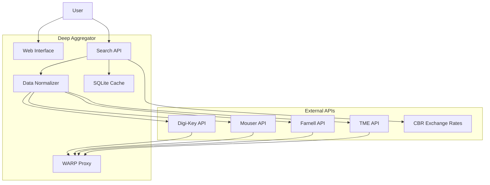
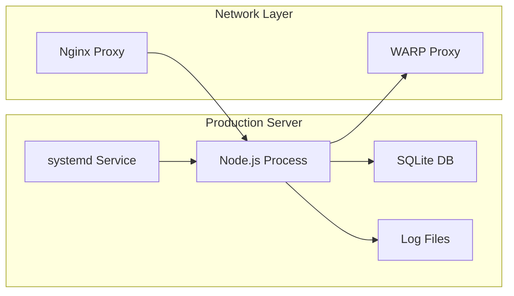

# Architecture Overview

## System Context

## Container Architecture

The system is deployed as a single Node.js service with the following components:

### Core Services
- **Express Server**: HTTP API and static file serving
- **Search Engine**: Query processing and provider orchestration
- **Data Normalizer**: Converts provider-specific responses to unified format
- **Cache Layer**: SQLite-based caching for performance

### External Integrations
- **Provider APIs**: OAuth 2.0 and API key based authentication
- **Currency Service**: Central Bank of Russia exchange rate API
- **Proxy Service**: Cloudflare WARP for IP-based restrictions

## Deployment Model

## Data Flow

### Search Request Flow

1. **User Input**: Component part number or keyword
2. **Query Enhancement**: Russian-to-English translation if needed
3. **Provider Selection**: Determine which APIs to query
4. **Parallel Requests**: Execute provider API calls simultaneously
5. **Data Normalization**: Convert responses to unified schema
6. **Price Conversion**: Apply CBR exchange rates
7. **Primary Selection**: Choose best data source
8. **Response Assembly**: Combine primary + supplementary data
9. **Cache Storage**: Store results for future requests
10. **User Response**: Return formatted results

### Provider Priority Logic

1. **Primary Source**: Provider with both pricing and stock data
2. **Fallback Sources**: Additional providers for supplementary data
3. **Latency Consideration**: Faster response preferred for primary
4. **Data Quality**: Complete data fields preferred

## Technology Stack

- **Runtime**: Node.js 18+
- **Framework**: Express.js
- **Database**: SQLite 3
- **Authentication**: Passport.js (OAuth 2.0, Local)
- **Monitoring**: Prometheus metrics
- **Documentation**: MkDocs with Material theme
- **Proxy**: Cloudflare WARP
- **Process Management**: systemd
