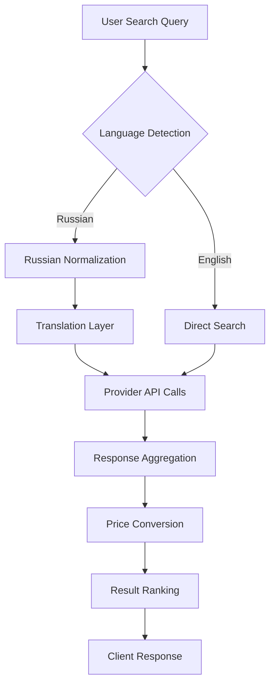

# Search Flow Architecture

The platform provides intelligent Russian-to-English search translation with multi-provider aggregation.

## Overview



## Search Endpoints

### Live Search API

**URL**: `/api/live-search`
**Method**: GET
**Parameters**:
- `q` (required): Search query
- `lang` (optional): Force language detection override

### Request Flow

#### 1. Query Processing

```javascript
// Input normalization
const query = req.query.q.trim();
const detectedLang = detectLanguage(query);
const normalizedQuery = normalizeQuery(query, detectedLang);
```

#### 2. Language Detection

The system identifies query language using:
- **Cyrillic Character Detection**: `/[\u0400-\u04FF]/` regex
- **Common Russian Words**: Dictionary-based matching
- **Language Hint**: User preference or URL parameter

```javascript
function detectLanguage(query) {
  const cyrillicRatio = (query.match(/[\u0400-\u04FF]/g) || []).length / query.length;
  return cyrillicRatio > 0.3 ? 'ru' : 'en';
}
```

#### 3. Russian Query Processing

For Russian queries, the system applies multiple normalization layers:

```javascript
const russianNormalization = {
  // Common electronic terms
  'резистор': 'resistor',
  'конденсатор': 'capacitor',
  'микроконтроллер': 'microcontroller',
  
  // Technical specifications
  'ом': 'ohm',
  'вольт': 'volt',
  'ампер': 'amp',
  
  // Package types
  'корпус': 'package',
  'поверхностный монтаж': 'smd'
};
```

## Provider Search Implementation

### Sequential Provider Calls

```javascript
async function searchProviders(query, language) {
  const providers = ['digikey', 'mouser', 'farnell', 'tme'];
  const results = [];
  
  for (const provider of providers) {
    if (isProviderEnabled(provider)) {
      try {
        const response = await searchProvider(provider, query);
        results.push({
          provider,
          products: response.products || [],
          totalCount: response.totalCount || 0
        });
      } catch (error) {
        console.error(`Provider ${provider} failed:`, error);
        results.push({
          provider,
          products: [],
          error: error.message
        });
      }
    }
  }
  
  return results;
}
```

### Provider-Specific Search Logic

#### Digi-Key Search
```javascript
// GET /Search/v3/Products/Keyword
const digikeySearch = async (query) => {
  const response = await fetch(`${DIGIKEY_API}/Search/v3/Products/Keyword`, {
    method: 'POST',
    headers: {
      'Authorization': `Bearer ${oauth_token}`,
      'Content-Type': 'application/json'
    },
    body: JSON.stringify({
      Keywords: query,
      RecordCount: 50,
      RecordStartPosition: 0,
      Sort: { SortOption: 'SortByUnitPrice', Direction: 'Ascending' }
    })
  });
  
  return await response.json();
};
```

#### Mouser Search
```javascript
// GET /api/v1/search/keyword
const mouserSearch = async (query) => {
  const url = `${MOUSER_API}/api/v1/search/keyword?apiKey=${MOUSER_API_KEY}&keyword=${encodeURIComponent(query)}`;
  const response = await fetch(url);
  return await response.json();
};
```

#### TME Search
```javascript
// POST /Products/Search
const tmeSearch = async (query) => {
  const response = await fetch(`${TME_API}/Products/Search`, {
    method: 'POST',
    headers: {
      'Authorization': `Bearer ${tme_token}`,
      'Content-Type': 'application/json'
    },
    body: JSON.stringify({
      SearchPlain: query,
      Country: 'RU',
      Language: 'RU'
    })
  });
  
  return await response.json();
};
```

## Response Processing

### Product Normalization

Each provider returns different response formats. The system normalizes to canonical structure:

```javascript
const canonicalProduct = {
  mpn: product.manufacturerPartNumber,
  manufacturer: product.manufacturer.name,
  description: product.productDescription,
  datasheet: product.primaryDatasheet,
  pricing: normalizePricing(product.standardPricing),
  stock: product.quantityAvailable,
  provider: 'digikey',
  providerSku: product.digiKeyPartNumber,
  updated: new Date().toISOString()
};
```

### Price Conversion

All pricing is converted to Russian Rubles using CBR exchange rates:

```javascript
function convertPricing(pricing, rates) {
  return pricing.map(tier => ({
    quantity: tier.BreakQuantity,
    price_original: tier.UnitPrice,
    currency_original: tier.Currency,
    price_rub: tier.UnitPrice * rates[tier.Currency],
    currency_rub: 'RUB'
  }));
}
```

### Result Aggregation

Results from all providers are merged and ranked:

```javascript
function aggregateResults(providerResults) {
  const allProducts = [];
  
  providerResults.forEach(result => {
    result.products.forEach(product => {
      allProducts.push(normalizeProduct(product, result.provider));
    });
  });
  
  // Remove duplicates by MPN
  const uniqueProducts = deduplicateByMPN(allProducts);
  
  // Sort by price (lowest first)
  return uniqueProducts.sort((a, b) => a.minPriceRub - b.minPriceRub);
}
```

## Search Performance

### Caching Strategy

```javascript
const searchCache = new Map();
const CACHE_TTL = 5 * 60 * 1000; // 5 minutes

function getCachedResult(query) {
  const key = query.toLowerCase().trim();
  const cached = searchCache.get(key);
  
  if (cached && Date.now() - cached.timestamp < CACHE_TTL) {
    return cached.data;
  }
  
  return null;
}
```

### Parallel Processing

Provider calls are executed in parallel where possible:

```javascript
const searchPromises = enabledProviders.map(provider => 
  searchProvider(provider, query).catch(error => ({ provider, error }))
);

const results = await Promise.allSettled(searchPromises);
```

## Error Handling

### Provider Failures

Individual provider failures don't block the entire search:

```javascript
try {
  const result = await searchProvider(provider, query);
  return { provider, success: true, data: result };
} catch (error) {
  console.error(`Provider ${provider} search failed:`, error);
  return { 
    provider, 
    success: false, 
    error: error.message,
    data: { products: [], totalCount: 0 }
  };
}
```

### Fallback Responses

When all providers fail, the system returns structured error responses:

```javascript
if (allProvidersFailed) {
  return {
    ok: false,
    query: originalQuery,
    language: detectedLanguage,
    providers: [],
    error: 'All search providers are currently unavailable',
    suggestion: 'Please try again later or contact support'
  };
}
```

## Search Analytics

### Query Tracking

```javascript
// Track search patterns
metrics.searchRequests.inc({
  language: detectedLanguage,
  provider_count: enabledProviders.length,
  result_count: totalResults
});

// Track translation accuracy
if (detectedLanguage === 'ru') {
  metrics.translationRequests.inc({
    original_query: query,
    translated_query: translatedQuery
  });
}
```

### Performance Metrics

- **Search Latency**: Time from request to response
- **Provider Response Times**: Individual API call durations
- **Cache Hit Rate**: Percentage of cached vs live searches
- **Translation Accuracy**: Manual verification of Russian→English conversion

## Frontend Integration

### Search UI Implementation

```javascript
// Real-time search with debouncing
const searchInput = document.getElementById('search-query');
let searchTimeout;

searchInput.addEventListener('input', (e) => {
  clearTimeout(searchTimeout);
  searchTimeout = setTimeout(() => {
    performSearch(e.target.value);
  }, 300);
});

async function performSearch(query) {
  if (query.length < 2) return;
  
  const response = await fetch(`/api/live-search?q=${encodeURIComponent(query)}`);
  const results = await response.json();
  
  displayResults(results);
}
```

### Language Detection UI

```javascript
// Show detected language to user
function displayLanguageDetection(query, detectedLang) {
  const indicator = document.getElementById('language-indicator');
  
  if (detectedLang === 'ru') {
    indicator.innerHTML = `🇷🇺 Поиск на русском: "${query}"`;
    indicator.className = 'language-ru';
  } else {
    indicator.innerHTML = `🇺🇸 English search: "${query}"`;
    indicator.className = 'language-en';
  }
}
```
