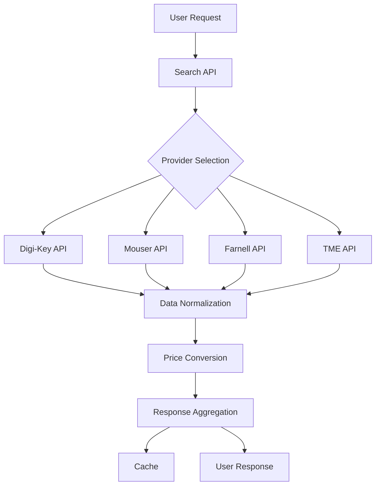

# Deep Components Aggregator

Electronic components search and price aggregation platform.

## Overview

Deep Components Aggregator is a unified search platform that aggregates electronic component data from multiple suppliers including Digi-Key, Mouser, Farnell, and TME.

## Key Features

- **Multi-provider search**: Search across 4+ major electronic component suppliers
- **Price aggregation**: Compare prices across suppliers with RUB conversion
- **Real-time inventory**: Live stock information from supplier APIs
- **Intelligent routing**: Proxy-based access for global suppliers
- **Prometheus metrics**: Comprehensive observability and monitoring

## Quick Start

1. Visit the search interface at `/`
2. Enter a component part number (e.g., `DS12C887+`, `STM32F103C8T6`)
3. Review results from multiple suppliers
4. Compare prices in local currency (RUB)

## API Endpoints

- `GET /api/search?q={query}` - Search components
- `GET /api/product?mpn={mpn}` - Get detailed product information
- `GET /api/health` - System health and provider status
- `GET /api/metrics` - Prometheus metrics
- `GET /api/currency/rates` - Current exchange rates

## Provider Status

The platform supports the following component suppliers:

| Provider | Status | Auth Method | Coverage |
|----------|--------|-------------|----------|
| Digi-Key | ✅ Active | OAuth 2.0 | Global |
| Mouser | ⚠️ Configured | API Key | US/Global |
| Farnell | ⚠️ Configured | API Key | UK/EU |
| TME | ⚠️ Configured | Token/Secret | EU |

!!! info "Provider Configuration"
    Provider credentials are configured via environment variables and not stored in the repository.

## Architecture

## Development

See the [Architecture](architecture/overview.md) section for detailed technical documentation.
